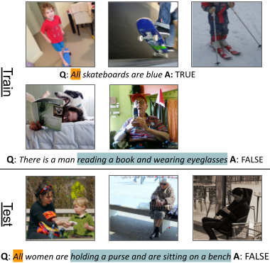

**COVR** is a test-bed for visually-grounded compositional generalization with real images. You can use COVR to train Visual Question Answering (VQA) models and evaluate it on various compositional generalization tests, and possibly create your own new compositional splits.

For more details refer to [our paper](#paper).

<!-- <p align="center" width="100%"> -->

<!-- </p> -->

## Paper

[**COVR: A Test-Bed for Visually Grounded Compositional Generalization with Real Images**][paper]

Ben Bogin, Shivanshu Gupta, Matt Gardner, Jonathan Berant
**EMNLP 2021**

```markdown
@article{Bogin2021COVR,
  title={COVR: A Test-Bed for Visually Grounded Compositional Generalization
with Real Images},
  author={Bogin, Ben and Gupta, Shivanshu and Gardner, Matt and Berant, Jonathan},
  year={2021}
}
```


## Statistics

| Measurement                    | Train  | Dev. + Test |
| ------------------------------ | ------ | ----------- |
| # total questions              | 248.1k | 13.9k       |
| # unique questions             | 122.0k | 7.6k        |
| # unique answers               | 3666   | 1268        |
| # unique images                | 79.0k  | 9.5k        |
| # unique anonymized programs   | 635    | 291         |
| # `True/False (T/F)` questions | 133.3k | 7.5k        |
| # `X or Y` questions           | 50.0k  | 2.9k        |
| # `how many ...` questions     | 33.3k  | 1.8k        |
| # Open questions               | 31.5k  | 1.7k        |
| avg. # question words (a/p\*)  | 14.0   | 13.5/11.9  |
| avg. # images per question     | 4.4    | 3.4         |

<small>\* a: automatically-generated, p: paraphrased</small>

## Leaderboard



## Explore

[Explore COVR](/explore) to view examples from COVR

## Download

* For the full documentation of the dataset and its format please refer to our [Github repository][repo].
* Click here to [download COVR][download].

## Authors



[download]: {{ layout.download }}
[repo]: {{ layout.repo }}
[paper]: {{ layout.paper }}
